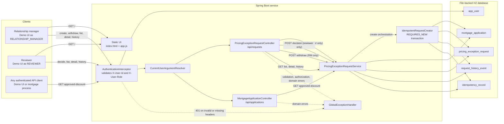
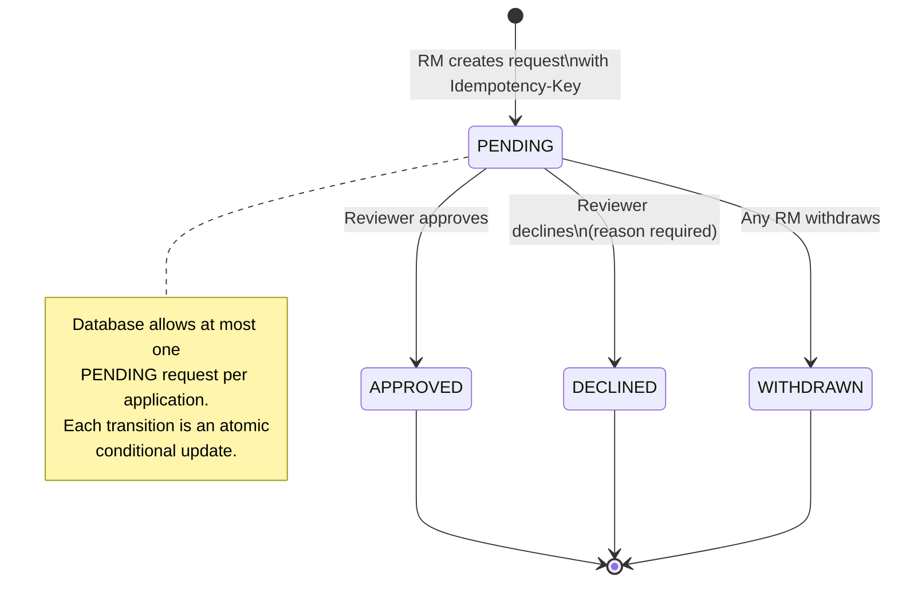

# Mortgage Pricing Exception Service

A small Spring Boot (Java 21) HTTP API that manages **mortgage pricing exception requests**:
relationship managers (RMs) request a discount (in basis points) off the standard rate on a
mortgage application, reviewers approve or decline the request, and a downstream mortgage
application process can look up the currently-approved discount for an application. Every state
transition is recorded in an append-only audit trail.

This was built as a take-home-style exercise. This README documents the problem understanding, the
decisions made on the deliberately-ambiguous/conflicting points in the brief, the API, how to run
and test it, and what would need to change for real production use.

## 1. Problem understanding and scope

- RMs create pricing exception requests against an existing mortgage application, with a
  requested discount and a reason.
- Reviewers approve or decline pending requests, and any RM can withdraw a pending request (not
  only its creator — see §2 continuity note).
- A mortgage application process needs to query "what discount, if any, is currently approved for
  this application" without needing to know about the review workflow.
- Every state transition must be auditable (who did what, when, and why).
- Create must be safe to retry (idempotent) since RM clients may resubmit on network failure.
- Everything must run locally with no paid/private infrastructure.

## 2. Decisions on ambiguous / conflicting requirements

These were explicitly called out in the brief as needing a decision. All are implemented exactly
as described below — they are not open questions.

- **Editing after submission vs. "approvals apply to the exact request reviewed":** resolved in
  favour of immutability. `PricingExceptionRequest` has **no update/edit endpoint**. Once created,
  `applicationId`, `requestedDiscountBps` and `reason` never change. PENDING can only transition to
  APPROVED, DECLINED (via a reviewer) or WITHDRAWN (via any RM); all three are terminal.
  If an RM wants different terms, they withdraw the pending request and create a new one. This
  guarantees a reviewer's decision always applies to precisely the request they read — no risk of
  a "bait and switch" between review and decision.
- **Who may withdraw a pending request:** any authenticated RM, not only its creator. This
  mirrors the reviewer side of the workflow, where any REVIEWER may decide on a request regardless
  of who it was assigned to — there is no concept of "my" review queue vs. "someone else's".
  Restricting withdrawal to the original creator would break continuity (e.g. an RM on leave with
  a request that needs pulling back), and the risk is low: withdrawal only affects a `PENDING`
  request (nothing already decided), and the acting user is still recorded on the `WITHDRAWN`
  history event, so accountability is preserved.
- **Idempotency key:** the client supplies an opaque `Idempotency-Key` header (any client-generated
  string, e.g. a UUID) on `POST /api/requests`. It is *not* derived from the payload, so the same
  logical retry (same key) can be distinguished from a genuinely new request that happens to look
  similar. **Scoped per caller**: the primary key is `(managerId, idempotencyKey)`, not the key
  alone — two different relationship managers may reuse the same key value independently without
  colliding or seeing each other's stored response (this was flagged in review and fixed; see the
  `idempotency_sameKeyDifferentManager_isIndependent` test). The stored request body hash detects
  (and rejects with 409) a key being reused for a different payload within the same manager's
  scope — a sign of a client bug rather than a legitimate retry.
- **One open request per application:** at most one `PENDING` request is allowed per application at
  a time, enforced both at the application layer (a friendly `409` pre-check) and at the database
  layer (a unique index on a computed column that's non-null only for `PENDING` rows — see §8 —
  which is what actually wins any true concurrent-create race). Once a request reaches a terminal
  status, a new request may be submitted for the same application (e.g. renegotiating terms later
  in the application's life). `GET /api/applications/{id}/approved-discount` follows a
  **supersession policy**: the most recently approved request is authoritative; older approved
  requests remain untouched in the audit trail but are no longer "current". This was an
  undocumented gap flagged in review (multiple requests could previously be approved for the same
  application with no defined winner) and is now an explicit, tested policy.
- **Authorization model:** roles are `RELATIONSHIP_MANAGER` and `REVIEWER`, seeded as `AppUser`
  rows. Real OAuth2/JWT auth is out of scope for this exercise; instead every request carries
  simulated identity via `X-User-Id` / `X-User-Role` headers, validated against the seeded users
  (see §7 for why, and §11 for what a production version would use instead).
- **Concurrent decisions:** exactly one of two racing decisions (or a decision racing a withdrawal)
  can win. Implemented as a single conditional atomic `UPDATE ... WHERE status = 'PENDING'`
  (see §6). A dedicated concurrency test exercises this with two threads and a `CountDownLatch`.
- **Data retention / scale:** out of scope for this exercise — no expiry, archival, or pagination
  is implemented; see §11 for what would be added for production scale.
- **Storage:** H2, file-based (`./data/rate-concession`), so state survives restarts during local
  exploration, with Flyway-managed schema and seed data (§8).
- **Approved-discount response shape:** returns just the current approved discount and its
  provenance (who/when/which request), not the full history — the mortgage process doesn't need
  the review history, and can call `GET /api/requests/{id}/history` separately if it ever does.
  "No approved discount yet" is a normal 200 response, not an error, since it's an expected steady
  state for a request that's pending, declined, or never made.

## 3. Domain model

| Entity | Purpose |
|---|---|
| `AppUser` | Simulated authenticated principal: id, name, role (`RELATIONSHIP_MANAGER` / `REVIEWER`). |
| `MortgageApplication` | The application a discount request is raised against; has a standard rate. |
| `PricingExceptionRequest` | The request itself: discount, reason, status, creator, decision metadata, optimistic-lock `version`. |
| `RequestHistoryEvent` | Append-only audit row, one per transition (`CREATED`, `APPROVED`, `DECLINED`, `WITHDRAWN`). |
| `IdempotencyRecord` | Maps an `Idempotency-Key` to the stored outcome of the first successful create. |

State machine: `PENDING → APPROVED | DECLINED | WITHDRAWN` (all terminal). No other transitions
exist.

## 4. API reference

Base path: `/api`. All endpoints require the headers below; all error responses share one JSON
shape.

### Common headers

| Header | Required on | Notes |
|---|---|---|
| `X-User-Id` | every `/api/**` request | Must match a seeded `AppUser` id. |
| `X-User-Role` | every `/api/**` request | Must equal that user's actual seeded role. |
| `Idempotency-Key` | `POST /api/requests` only | Any client-chosen string; reused per logical retry. |

Missing/invalid `X-User-Id`/`X-User-Role`, or a role mismatch, or an unknown user id → **401**.
Missing `Idempotency-Key` on create → **400**.

### Error shape

```json
{
  "timestamp": "2025-01-06T09:15:00Z",
  "status": 404,
  "error": "Not Found",
  "message": "Pricing exception request not found: ...",
  "path": "/api/requests/...",
  "fieldErrors": null
}
```

`fieldErrors` is populated (list of `{field, message}`) only for Bean Validation failures on
create.

### Endpoints

#### `POST /api/requests` — create (RM only)

Request:
```json
{ "applicationId": "app-1001", "requestedDiscountBps": 25, "reason": "Competing offer from another lender" }
```
- `requestedDiscountBps`: integer, `1..500`.
- `reason`: non-blank, max 2000 characters.
- `applicationId`: must reference an existing `MortgageApplication` (404 if not); max 64 characters.
- `Idempotency-Key` header: required, max 255 characters.
- Rejected with `409` if the application already has another `PENDING` request open (see §2,
  "one open request per application").

Response `201`:
```json
{
  "id": "11111111-1111-1111-1111-111111111111",
  "applicationId": "app-1001",
  "requestedDiscountBps": 25,
  "reason": "Competing offer from another lender",
  "status": "PENDING",
  "createdByUserId": "rm-1",
  "createdAt": "2025-01-06T09:15:00Z",
  "decidedByUserId": null,
  "decidedAt": null,
  "decisionReason": null,
  "version": 0
}
```
Idempotency: repeating the same `Idempotency-Key` with the same body replays the original `201`
response (no new row created). Repeating it with a **different** body → `409`.

Errors: `400` (validation / missing Idempotency-Key), `401`, `403` (caller isn't an RM), `404`
(unknown `applicationId`), `409` (Idempotency-Key reused with a different body).

#### `GET /api/requests/{id}` — fetch one (any authenticated user)

Returns the same shape as create's response. `404` if not found.

#### `GET /api/requests/{id}/history` — audit trail (any authenticated user)

Returns an ordered array of history events:
```json
[
  { "id": 1, "requestId": "...", "eventType": "CREATED", "actorUserId": "rm-1", "timestamp": "...", "notes": null },
  { "id": 2, "requestId": "...", "eventType": "APPROVED", "actorUserId": "rev-1", "timestamp": "...", "notes": "Approved given excellent credit history." }
]
```
`404` if the request doesn't exist.

#### `GET /api/requests?applicationId=...&status=...` — list/filter (any authenticated user)

Both query params optional and combinable. `status` is one of `PENDING`, `APPROVED`, `DECLINED`,
`WITHDRAWN`. Results are ordered **newest-created first** (`createdAt DESC`) — deterministic, so
API/UI behaviour is predictable even without pagination (see §11 for why pagination itself is
deferred, and note this ordering was added specifically so that gap doesn't also mean *undefined*
ordering in the meantime).

#### `POST /api/requests/{id}/decision` — approve/decline (reviewer only)

Request:
```json
{ "decision": "APPROVE", "reason": "Approved given excellent credit history." }
```
`decision` is `APPROVE` or `DECLINE`. `reason` is required for `DECLINE`, optional for `APPROVE`.

Response `200`: updated request representation.

Errors: `400` (missing reason for DECLINE), `403` (caller isn't a reviewer), `404` (not found),
`409` (request is no longer `PENDING`).

#### `POST /api/requests/{id}/withdraw` — withdraw (any relationship manager)

Request body optional: `{ "reason": "Client changed their mind" }`.

Response `200`: updated request representation.

Any authenticated RM may withdraw a pending request, not only its creator — this supports
continuity (e.g. covering for an absent colleague) and mirrors how any REVIEWER may decide on a
request regardless of who it was assigned to. The actor is still recorded on the `WITHDRAWN`
history event, so accountability is preserved even though the ownership check is not enforced.

Errors: `403` (caller is a reviewer), `404` (not found), `409` (request is no longer `PENDING`).

#### `GET /api/applications/{applicationId}/approved-discount` — for the mortgage process (any authenticated user)

If an approval exists:
```json
{ "applicationId": "app-1002", "discountBps": 15, "hasApprovedDiscount": true, "decidedByUserId": "rev-1", "decidedAt": "2025-01-04T10:30:00Z", "requestId": "22222222-2222-2222-2222-222222222222" }
```
If none:
```json
{ "applicationId": "app-1003", "discountBps": null, "hasApprovedDiscount": false, "decidedByUserId": null, "decidedAt": null, "requestId": null }
```
`404` only if `applicationId` itself doesn't exist (a "no approval yet" application is a normal
`200`, not an error).

### Example curl session

```bash
# Create (as RM rm-1)
curl -s -X POST http://localhost:8080/api/requests \
  -H "X-User-Id: rm-1" -H "X-User-Role: RELATIONSHIP_MANAGER" \
  -H "Idempotency-Key: $(uuidgen)" -H "Content-Type: application/json" \
  -d '{"applicationId":"app-1004","requestedDiscountBps":20,"reason":"Loyalty discount"}'

# Approve (as reviewer rev-1) - substitute the id from the create response
curl -s -X POST http://localhost:8080/api/requests/<id>/decision \
  -H "X-User-Id: rev-1" -H "X-User-Role: REVIEWER" -H "Content-Type: application/json" \
  -d '{"decision":"APPROVE","reason":"Looks good"}'

# Check the approved discount
curl -s http://localhost:8080/api/applications/app-1004/approved-discount \
  -H "X-User-Id: rm-1" -H "X-User-Role: RELATIONSHIP_MANAGER"
```

## 5. Seeded data

Flyway seeds (`V2__seed_data.sql`) the following so the whole workflow can be exercised
immediately:

| User id | Name | Role |
|---|---|---|
| `rm-1` | Dana Whitfield | RELATIONSHIP_MANAGER |
| `rm-2` | Marcus Ojo | RELATIONSHIP_MANAGER |
| `rev-1` | Priya Kapoor | REVIEWER |
| `rev-2` | Tom Bracewell | REVIEWER |

Mortgage applications `app-1001` .. `app-1005` (varied standard rates), plus one `PENDING`, one
`APPROVED` (with full history), and one `DECLINED` (with full history) example request.

## 6. Concurrency handling

Decision and withdrawal both go through
`PricingExceptionRequestRepository.transitionIfPending(...)`, a single
`@Modifying @Query("update ... where id = :id and status = 'PENDING'")` executed inside a
`@Transactional` service method. The returned affected-row count (0 or 1) is checked; `0` means
someone else already transitioned the request first, and the caller gets a `409 Conflict`
("Request is no longer PENDING..."). This makes the whole read-decide-write sequence atomic at the
database level without needing explicit row locking — the database's own row-level write lock on
the `UPDATE ... WHERE` serializes concurrent attempts, and only one can match the `WHERE status =
'PENDING'` predicate. A `@Version` column is also present for defense-in-depth against
non-transition writes, though the current design has no such writes.

`ConcurrentDecisionTest` fires two reviewer decisions at the same request from two threads,
synchronized with a `CountDownLatch` to maximise overlap, and asserts exactly one gets `200` and
the other `409`.

## 7. Simulated authentication/authorization

There is no Spring Security dependency. A `HandlerInterceptor`
(`AuthenticationInterceptor`) resolves `X-User-Id`/`X-User-Role` against the seeded `AppUser`
table on every `/api/**` request, attaches the validated user to the request, and a
`HandlerMethodArgumentResolver` (`CurrentUserArgumentResolver`) makes it available to controllers
via a `@CurrentUser AppUser` parameter. Role checks (RM-only for create/withdraw, reviewer-only
for decide) are then simple checks in the controller/service layer — there is no ownership check
on withdrawal (see §2). This was chosen over pulling in
Spring Security because the exercise doesn't need real credential verification, token parsing, or
session handling — an interceptor is enough to demonstrate the shape of "authenticate, then
authorize" without the added surface area of a security framework stand-in for OAuth2/JWT (see §11
for what a real deployment would use instead).

## 8. Storage & migrations

H2, file-based (`jdbc:h2:file:./data/rate-concession`) so data persists across restarts of the
running app; Flyway migrations live in `src/main/resources/db/migration`:
- `V1__init_schema.sql` — all tables, foreign keys, and indexes on
  `pricing_exception_request(application_id)` and `(status)`. Also defines a computed column,
  `pending_application_id` (non-null only when `status = 'PENDING'`), with a unique index on it —
  H2 (like most SQL databases) doesn't support `WHERE`-clause partial unique indexes directly, so
  this is the standard workaround: unique indexes ignore `NULL`s, so terminal-status rows are
  unconstrained while at most one `PENDING` row per `application_id` is allowed. This is the
  database-level backstop for the "one open request per application" rule (§2); the service layer
  also does a friendly pre-check so the common case returns a clear `409` message rather than a
  raw constraint-violation-derived one.
  Also note: `idempotency_record`'s primary key is the composite `(manager_id, idempotency_key)`,
  not the key alone, so idempotency is scoped per caller (§2).
- `V2__seed_data.sql` — seed users, applications, and example requests/history (§5).

`spring.jpa.hibernate.ddl-auto=validate` — the schema is owned entirely by Flyway; Hibernate only
validates the mapping matches it.

> **Deviation from the brief:** the brief's example URL includes `;AUTO_SERVER=TRUE`. In this
> development sandbox, H2's auto-server mode attempted to open a TCP connection to a non-loopback
> address and timed out (a sandbox networking restriction), so the shipped config omits it. Add it
> back (`jdbc:h2:file:./data/rate-concession;AUTO_SERVER=TRUE`) if you need multiple local
> processes (e.g. the app plus a separate H2 console client) to open the same file concurrently;
> for a single running app instance (as here, with the H2 console served in-process) it isn't
> required.

The H2 console is enabled at `/h2-console` for local exploration only — **disable it before any
production deployment** (`spring.h2.console.enabled=false`), since it exposes a SQL query UI over
HTTP.

Tests run against an isolated in-memory H2 instance (`jdbc:h2:mem:testdb-<random>`) via the `test`
Spring profile (`src/test/resources/application-test.yaml`), with Flyway migrations applied the
same way as at runtime, so the schema is exercised by the test suite too.

## 9. Setup, run, and test instructions

This project ships a `.mvn/settings.xml` that forces Maven Central and bypasses any machine-wide
mirror configuration. **The `-s .mvn/settings.xml` flag is required on every `mvnw` invocation:**

```bash
# Run the app (serves the API and the bonus UI at http://localhost:8080/)
./mvnw -s .mvn/settings.xml spring-boot:run

# Run the full test suite
./mvnw -s .mvn/settings.xml test

# Just compile
./mvnw -s .mvn/settings.xml compile
```

Once running:
- **Bonus UI**: http://localhost:8080/ — pick a seeded user from the dropdown, create/list/view
  requests, approve/decline/withdraw, and look up an application's approved discount.
- **H2 console**: http://localhost:8080/h2-console — JDBC URL `jdbc:h2:file:./data/rate-concession`,
  user `sa`, empty password.
- Data persists in `./data/rate-concession.mv.db`; delete that file (or the `data/` directory) to
  reset to a freshly-seeded state.

See §5 for the seeded user ids/roles to use with curl or the UI dropdown.

## 10. Architecture notes

### Implemented client and backend flows

The only implemented client is the vanilla-JS demo UI served from `/`. It selects one of the
seeded users and sends the corresponding simulated-authentication headers on every API call.
The approved-discount endpoint is also available to any other authenticated API client; no
separate mortgage-origination client is implemented in this repository.





```
src/main/java/com/mortgage/rate_concession_service/
  domain/       JPA entities + enums (AppUser, MortgageApplication, PricingExceptionRequest,
                RequestHistoryEvent, IdempotencyRecord, UserRole, RequestStatus, EventType)
  repository/   Spring Data JPA repositories, including the conditional-update query
  service/      Use-case services: PricingExceptionRequestService (decide/withdraw/list/history/
                approved-discount), IdempotentRequestCreator (isolated REQUIRES_NEW bean so the
                propagation actually takes effect through the AOP proxy), HashUtil
  security/     AuthenticationInterceptor, CurrentUser annotation + argument resolver
  config/       WebMvcConfig wiring the interceptor/resolver in
  web/          Controllers, DTOs, GlobalExceptionHandler
  exception/    Domain exceptions mapped to HTTP status codes
```

Why an interceptor for auth: see §7. Why the conditional-update pattern for concurrency: see §6.
Why immutability of requests: see §2. `IdempotentRequestCreator` is its own Spring bean (rather
than a method on the main service) because `@Transactional(propagation = REQUIRES_NEW)` only takes
effect through the Spring AOP proxy — calling it as a same-class method (self-invocation) would
silently run in the caller's existing transaction instead.

**Spring Boot 4 note:** this project targets Spring Boot 4.1.1, which modularized several
autoconfiguration concerns that used to ship in single starters. You'll notice the pom explicitly
depends on `spring-boot-starter-flyway`, `spring-boot-webmvc-test` (test scope, for
`@AutoConfigureMockMvc`), and `spring-boot-h2console` — Flyway/H2-console/MockMvc autoconfiguration
no longer come "for free" with `flyway-core`, `h2`, and `spring-boot-starter-test` alone.

## 11. Production-readiness notes

What would change before this went anywhere near production:
- **Real authentication**: replace the `X-User-Id`/`X-User-Role` header stand-in with OAuth2/JWT
  (e.g. Spring Security's resource-server support), with roles/claims from a real identity
  provider, not a seeded table.
- **Rate limiting** on write endpoints (create/decision/withdraw) to prevent abuse.
- **Structured logging, tracing, and monitoring**: correlation/request IDs, JSON logs, metrics
  (request counts/latencies/error rates per endpoint), and alerting on elevated 409/5xx rates.
- **Migration review process**: Flyway migrations should go through the same PR review as code,
  with a policy against editing already-applied migrations in shared environments.
- **Secrets management**: DB credentials, etc. via a vault/secret manager, not plaintext config.
- **Input validation hardening**: stricter length limits, allow-listing of characters in free-text
  fields, and reconsidering the 500bps upper bound with actual business/risk sign-off.
- **OWASP considerations**: this exercise doesn't face untrusted browsers directly, but a real
  deployment would need CSRF/consider CORS policy, output encoding review, dependency scanning,
  and disabling the H2 console entirely.
- **A real database** (e.g. PostgreSQL) with connection pooling tuned for the expected load,
  proper backups, and replication.
- **Retention/archival policy**: this exercise keeps all history forever; production would need an
  explicit retention window and an archival strategy for old requests/history.
- **Pagination** on `GET /api/requests` once volumes grow beyond a page. Note: the list is already
  deterministically ordered (newest-created first) even without pagination, so this is purely about
  bounding response size at scale, not about the ordering itself (see §4).
- **API versioning** (e.g. `/api/v1/...`) so the contract can evolve without breaking consumers.
- **Idempotency record retention**: currently kept forever; production should expire old
  `IdempotencyRecord` rows after a bounded retry window.

## 12. Agentic development

_Placeholder — to be filled in separately by the author._
