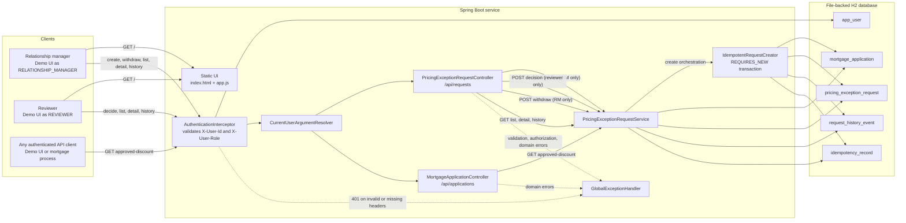
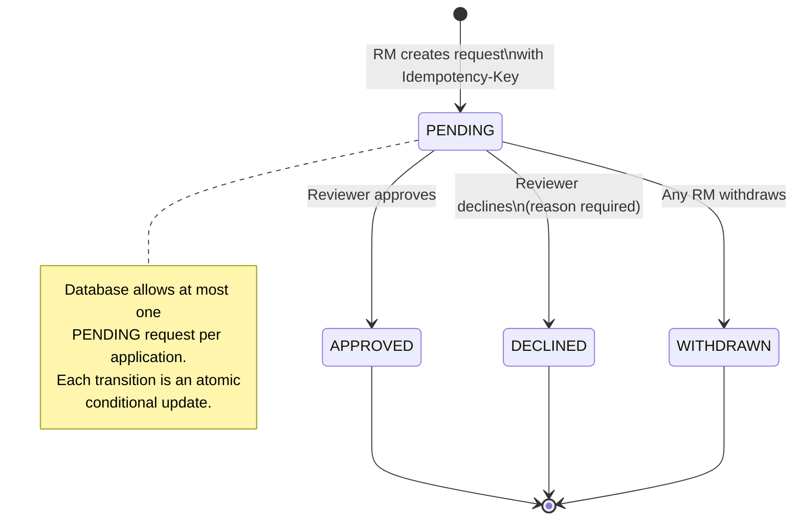

# Architecture notes

## Domain model

| Entity | Purpose |
|---|---|
| `AppUser` | Simulated authenticated principal: id, name, role (`RELATIONSHIP_MANAGER` / `REVIEWER`). |
| `MortgageApplication` | The application a discount request is raised against; has a standard rate. |
| `PricingExceptionRequest` | The request itself: discount, reason, status, creator, decision metadata, optimistic-lock `version`. |
| `RequestHistoryEvent` | Append-only audit row, one per transition (`CREATED`, `APPROVED`, `DECLINED`, `WITHDRAWN`). |
| `IdempotencyRecord` | Maps an `Idempotency-Key` to the stored outcome of the first successful create. |

State machine: `PENDING → APPROVED | DECLINED | WITHDRAWN` (all terminal). No other transitions
exist.

## Concurrency handling

Decision and withdrawal both go through
`PricingExceptionRequestRepository.transitionIfPending(...)`, a single
`@Modifying @Query("update ... where id = :id and status = 'PENDING'")` executed inside a
`@Transactional` service method. The returned affected-row count (0 or 1) is checked; `0` means
someone else already transitioned the request first, and the caller gets a `409 Conflict`
("Request is no longer PENDING..."). This makes the whole read-decide-write sequence atomic at the
database level without needing explicit row locking — the database's own row-level write lock on
the `UPDATE ... WHERE` serializes concurrent attempts, and only one can match the `WHERE status =
'PENDING'` predicate. A `@Version` column is also present for defense-in-depth against
non-transition writes, though the current design has no such writes.

`ConcurrentDecisionTest` fires two reviewer decisions at the same request from two threads,
synchronized with a `CountDownLatch` to maximise overlap, and asserts exactly one gets `200` and
the other `409`.

## Simulated authentication/authorization

There is no Spring Security dependency. A `HandlerInterceptor`
(`AuthenticationInterceptor`) resolves `X-User-Id`/`X-User-Role` against the seeded `AppUser`
table on every `/api/**` request, attaches the validated user to the request, and a
`HandlerMethodArgumentResolver` (`CurrentUserArgumentResolver`) makes it available to controllers
via a `@CurrentUser AppUser` parameter. Role checks (RM-only for create/withdraw, reviewer-only
for decide) are then simple checks in the controller/service layer — there is no ownership check
on withdrawal (see [DECISIONS.md](./DECISIONS.md)). This was chosen over pulling in Spring
Security because the exercise doesn't need real credential verification, token parsing, or
session handling — an interceptor is enough to demonstrate the shape of "authenticate, then
authorize" without the added surface area of a security framework stand-in for OAuth2/JWT (see
[PRODUCTION_READINESS.md](./PRODUCTION_READINESS.md) for what a real deployment would use
instead).

## Storage & migrations

H2, file-based (`jdbc:h2:file:./data/rate-concession`) so data persists across restarts of the
running app; Flyway migrations live in `src/main/resources/db/migration`:
- `V1__init_schema.sql` — all tables, foreign keys, and indexes on
  `pricing_exception_request(application_id)` and `(status)`. Also defines a computed column,
  `pending_application_id` (non-null only when `status = 'PENDING'`), with a unique index on it —
  H2 doesn't support `WHERE`-clause partial unique indexes directly (unlike, say, PostgreSQL,
  which does), so this is the standard workaround for databases without that feature: unique
  indexes ignore `NULL`s, so terminal-status rows are
  unconstrained while at most one `PENDING` row per `application_id` is allowed. This is the
  database-level backstop for the "one open request per application" rule (see
  [DECISIONS.md](./DECISIONS.md)); the service layer also does a friendly pre-check so the common
  case returns a clear `409` message rather than a raw constraint-violation-derived one.
  Also note: `idempotency_record`'s primary key is the composite `(manager_id, idempotency_key)`,
  not the key alone, so idempotency is scoped per caller (see [DECISIONS.md](./DECISIONS.md)).
- `V2__seed_data.sql` — seed users, applications, and example requests/history (see
  [../README.md](../README.md) for the seeded ids).

`spring.jpa.hibernate.ddl-auto=validate` — the schema is owned entirely by Flyway; Hibernate only
validates the mapping matches it.

The H2 console is enabled at `/h2-console` for local exploration only — **disable it before any
production deployment** (`spring.h2.console.enabled=false`), since it exposes a SQL query UI over
HTTP.

Tests run against an isolated in-memory H2 instance (`jdbc:h2:mem:testdb-<random>`) via the `test`
Spring profile (`src/test/resources/application-test.yaml`), with Flyway migrations applied the
same way as at runtime, so the schema is exercised by the test suite too.

## Implemented client and backend flows

The only implemented client is the vanilla-JS demo UI served from `/`. It selects one of the
seeded users and sends the corresponding simulated-authentication headers on every API call.
The approved-discount endpoint is also available to any other authenticated API client; no
separate mortgage-origination client is implemented in this repository.





```
src/main/java/com/mortgage/rate_concession_service/
  domain/       JPA entities + enums (AppUser, MortgageApplication, PricingExceptionRequest,
                RequestHistoryEvent, IdempotencyRecord, UserRole, RequestStatus, EventType)
  repository/   Spring Data JPA repositories, including the conditional-update query
  service/      Use-case services: PricingExceptionRequestService (decide/withdraw/list/history/
                approved-discount), IdempotentRequestCreator (isolated REQUIRES_NEW bean so the
                propagation actually takes effect through the AOP proxy), HashUtil
  security/     AuthenticationInterceptor, CurrentUser annotation + argument resolver
  config/       WebMvcConfig wiring the interceptor/resolver in
  web/          Controllers, DTOs, GlobalExceptionHandler
  exception/    Domain exceptions mapped to HTTP status codes
```
